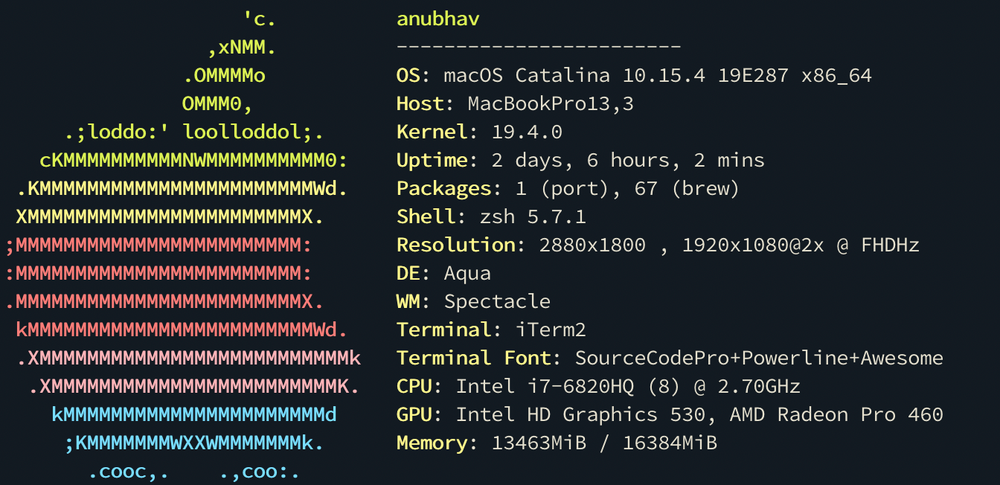

~~I frequently get questions about different tech stuff I use.~~ Actually, no one cares enough to ask me what I use 😂. But never the less, here is list of stuff that fits my daily routine and requirement.

Inspired by [awesome-use](https://github.com/wesbos/awesome-uses). 😊

Over the years (and couple of decades), my preferred platform for software development has gone through several drastic iterations. When I first started playing around with software development around 2006, I was using Pentium IV powered Machine as my primary computer along with TurboC Editor as my code editor of choice, since I was only working on C. As development environment was/isgoing through an evolutionary cycle, so has the languages that I use for coding. When I started out I worked primarily in C before switching to using mostly JavaScript/Typescript. I also had short stint with PHP, C# and Python.

 

## 💻&nbsp; Hardware

-   👨🏻‍💻 [**MacBook Pro 15"** (Late-2016)](https://browser.geekbench.com/v5/cpu/1921771)
    -   Intel i7 @ 2.7 GHZ
    -   16GB RAM/500GB SSD
    -   [ Intel HD Graphics 530 & AMD Radeon Pro 460 4 GB](https://browser.geekbench.com/v5/compute/813292)
    -   🐁 Magic Mouse 2 ⌨️ Magic Keyboard - US layout
-   💻 **Sony Vaio**
    -   💿[Elementary OS](https://elementary.io/)
    -   Intel i3
    -   4GB RAM/500GB Seagate HD
-   📱 [**Redmi Note 4 Pro 4GB/64GB**](https://www.gsmarena.com/xiaomi_redmi_note_4-8531.php) and [**Redmi Note 7 Pro 6GB/128GB**](https://www.gsmarena.com/xiaomi_redmi_note_7_pro-9521.php)
-   📖 [**Amazon Kindle Paperwhite**](https://www.amazon.com/All-new-Kindle-Paperwhite-Waterproof-Storage/dp/B07CXG6C9W)

## 💾&nbsp; Development

-   [**iTerm 2**](https://iterm2.com/)
    -   [Oh My ZSH](https://ohmyz.sh/)
-   [**Visual Studio Code**](https://code.visualstudio.com/)

## 🌎&nbsp; Browser

-   [**Google Chrome**](https://www.google.com/chrome/browser/?extra=devchannel) —
-   [**Google Chrome** (Dev Channel)](https://www.google.com/chrome/browser/?extra=devchannel) — for testing **only!**
-   [**Brave** ](https://brave.com/) — for all personal use.
